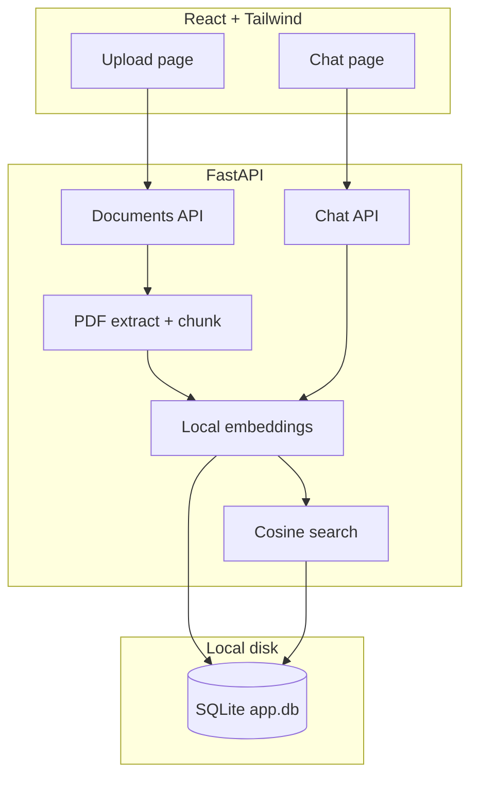

# PDF Vector MVP

A minimal full-stack app to **upload PDFs**, **extract text**, **generate embeddings locally**, **store them on disk**, and **chat** over your documents. No cloud API keys required.

## What it does

1. **Upload** — PDF files via the web UI or API
2. **Extract** — text from each page (`pypdf`)
3. **Embed** — vectors via [sentence-transformers](https://www.sbert.net/) (`all-MiniLM-L6-v2`, runs on your machine)
4. **Store** — SQLite database + JSON embeddings in `./data/` (Docker volume `app-data`)
5. **Chat** — ask questions; the API finds similar chunks and returns an answer with sources

## Architecture



### Stack

| Layer | Technology |
|-------|------------|
| Frontend | React 19, Vite, Tailwind CSS v4 |
| Backend | FastAPI, SQLAlchemy |
| Embeddings | sentence-transformers (local CPU) |
| Storage | SQLite file in `DATA_DIR` |
| Containers | Docker Compose (API + web) |

### Data flow

**Upload**

```
PDF → extract text → split chunks → embed (local model) → save to SQLite
```

**Chat**

```
Question → embed question → compare to all chunk vectors → top matches → formatted answer
```

Search uses in-memory cosine similarity over stored vectors. This is simple and fine for small document sets (MVP).

## Project structure

```
pdf-vector-api/
├── app/
│   ├── main.py
│   ├── config.py
│   ├── database.py
│   ├── models.py
│   ├── schemas.py
│   ├── routers/
│   │   ├── documents.py    # upload, list, search
│   │   └── chat.py         # POST /chat
│   └── services/
│       ├── pdf.py
│       ├── embeddings.py   # local model
│       ├── search.py
│       └── chat.py
├── frontend/               # React UI
├── data/                   # created at runtime (gitignored)
│   └── app.db
├── docker-compose.yml
├── Dockerfile
├── requirements.txt        # API deps
└── requirements-ml.txt     # sentence-transformers (needs CPU torch first)
```

## Prerequisites

- **Docker + Docker Compose** (easiest), or
- Python 3.12+, Node.js 20+, npm

No OpenAI or other API keys are needed.

## Quick start (Docker)

```bash
# From project root
docker compose up --build
```

| URL | Description |
|-----|-------------|
| http://localhost:3000 | Web UI |
| http://localhost:8000/docs | API docs |
| http://localhost:8000/health | Health check |

The Docker image uses **CPU-only PyTorch** (no CUDA wheels) so builds stay small and work on laptops without a GPU. The embedding model (~90MB) is downloaded during the image build.

Data persists in the Docker volume `app-data` (`/app/data/app.db` inside the API container).

## Local development

### 1. Backend

```bash
cp .env.example .env
python -m venv .venv

# Windows
.venv\Scripts\activate

# macOS / Linux
source .venv/bin/activate

# CPU-only PyTorch first (avoids large CUDA packages on Windows)
pip install torch==2.5.1 --index-url https://download.pytorch.org/whl/cpu
pip install -r requirements.txt -r requirements-ml.txt
uvicorn app.main:app --reload
```

API: http://localhost:8000

On first run, the embedding model may be downloaded to your Hugging Face cache.

### 2. Frontend

```bash
cd frontend
npm install
npm run dev
```

UI: http://localhost:5173 (proxies `/api` → http://localhost:8000)

## Configuration

| Variable | Default | Description |
|----------|---------|-------------|
| `DATABASE_URL` | `sqlite:///./data/app.db` | SQLite connection |
| `DATA_DIR` | `./data` | Directory for the database file |
| `EMBEDDING_MODEL` | `all-MiniLM-L6-v2` | sentence-transformers model name |
| `CHUNK_SIZE` | `1000` | Characters per chunk |
| `CHUNK_OVERLAP` | `200` | Overlap between chunks |

## API

| Method | Path | Description |
|--------|------|-------------|
| `GET` | `/health` | Health check |
| `POST` | `/documents/upload` | Upload PDF (`file` field) |
| `GET` | `/documents` | List documents |
| `GET` | `/documents/{id}/chunks` | List chunks |
| `DELETE` | `/documents/{id}` | Delete document and its chunks |
| `POST` | `/documents/search` | Semantic search |
| `POST` | `/chat` | Chat with documents |

### Examples

Upload:

```bash
curl -X POST http://localhost:8000/documents/upload -F "file=@report.pdf"
```

Chat:

```bash
curl -X POST http://localhost:8000/chat \
  -H "Content-Type: application/json" \
  -d '{"message": "What is the main topic?", "limit": 5}'
```

Delete document:

```bash
curl -X DELETE http://localhost:8000/documents/1
```

## Frontend pages

| Route | Page |
|-------|------|
| `/` | Upload PDFs, view indexed files |
| `/chat` | Ask questions about uploaded documents |

## How chat works

Chat is **retrieval-based** (not an LLM):

1. Your message is embedded with the same local model used at upload time.
2. The API scores every stored chunk by cosine similarity.
3. The top passages are combined into a readable answer with source citations.

This keeps the MVP simple, private, and free to run. You can add an LLM layer later on top of the same search results.

## Limitations (MVP)

- Text-based PDFs only (no OCR for scanned pages)
- Linear scan over all chunks (not optimized for huge corpora)
- No user accounts
- Chat answers are excerpts, not AI-generated prose

## Troubleshooting

| Issue | Fix |
|-------|-----|
| Docker build times out on `torch` | Rebuild with current `Dockerfile` — it installs CPU torch from `download.pytorch.org/whl/cpu` before other deps |
| `pip install` pulls huge CUDA torch locally | Run `pip install torch==2.5.1 --index-url https://download.pytorch.org/whl/cpu` before `requirements-ml.txt` |
| First upload is slow | Model is downloading; subsequent uploads are faster |
| "No extractable text" | PDF may be scanned images — OCR not included |
| Chat returns nothing | Upload at least one PDF with readable text first |
| Port in use | Change ports in `docker-compose.yml` |

## License

MIT (or add your own)
